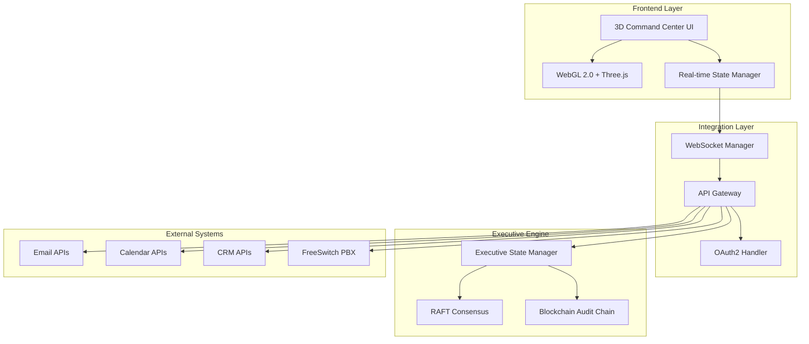

# Design Document

## Overview

The SOVREN AI Executive Command Center frontend redesign transforms a basic dashboard into an immersive 3D holographic command bridge. The system integrates 8 AI executives with real-world business systems through a high-performance React/Next.js application using WebGL 2.0 and Three.js for 3D rendering.

The architecture follows a microservices pattern with real-time synchronization, supporting email, calendar, CRM, and voice integrations while maintaining sub-100ms latency and 120 FPS performance. The design emphasizes visual storytelling through holographic interfaces, autonomous executive operations, and smart authorization workflows.

## Architecture

### High-Level System Architecture



### Frontend Architecture

The frontend uses a layered architecture optimized for 3D rendering and real-time updates:

**Presentation Layer (3D Scene)**
- Executive avatars with realistic animations
- Holographic UI elements and notifications
- Particle systems for visual effects
- Real-time data visualizations

**State Management Layer**
- Redux Toolkit for application state
- Real-time WebSocket connections
- Executive activity synchronization
- Authorization state management

**Integration Layer**
- API clients for external systems
- WebRTC for voice communications
- OAuth2 authentication flows
- Webhook handlers for real-time updates

**Performance Layer**
- GPU memory management
- Frame rate optimization
- Predictive resource allocation
- Caching strategies

## Components and Interfaces

### Core Components

#### ExecutiveCommandBridge
The main 3D scene component that renders the holographic command center.

```typescript
interface ExecutiveCommandBridge {
  executives: Executive[]
  activeIntegrations: Integration[]
  authorizationQueue: ApprovalRequest[]
  activityStream: ActivityEvent[]
  
  renderExecutives(): void
  updateExecutiveStates(states: ExecutiveState[]): void
  displayHolographicNotifications(notifications: Notification[]): void
  handleUserInteractions(gesture: GestureEvent): void
}
```

#### ExecutiveAvatar
Individual executive representation with realistic animations and activity indicators.

```typescript
interface ExecutiveAvatar {
  id: string
  name: string
  role: ExecutiveRole
  model: THREE.Object3D
  animations: AnimationMixer
  currentActivity: ActivityType
  
  updateActivity(activity: ActivityType): void
  showCallVisualization(callData: CallData): void
  displayEmailComposition(emailData: EmailData): void
  animateBreathing(): void
}
```

#### IntegrationManager
Handles all external system integrations with real-time synchronization.

```typescript
interface IntegrationManager {
  emailClient: EmailClient
  calendarClient: CalendarClient
  crmClient: CRMClient
  voiceClient: VoiceClient
  
  initializeConnections(): Promise<void>
  syncData(): Promise<void>
  handleWebhooks(webhook: WebhookEvent): void
  maintainRealTimeSync(): void
}
```

#### AuthorizationEngine
Manages approval workflows and executive authority levels.

```typescript
interface AuthorizationEngine {
  thresholds: AuthorizationThresholds
  pendingApprovals: ApprovalRequest[]
  
  evaluateAction(action: ExecutiveAction): AuthorizationResult
  createApprovalRequest(action: ExecutiveAction): ApprovalRequest
  processApproval(approval: ApprovalResponse): void
  visualizeImpact(action: ExecutiveAction): ImpactVisualization
}
```

### Integration Interfaces

#### Email Integration
```typescript
interface EmailIntegration {
  provider: 'Gmail' | 'Outlook' | 'Exchange'
  
  // Real-time email operations
  getUnifiedInbox(): Promise<Email[]>
  composeEmail(executive: Executive, draft: EmailDraft): Promise<void>
  sendEmail(email: Email, requiresApproval: boolean): Promise<void>
  trackEmailActivity(activity: EmailActivity): void
  
  // Visual integration
  visualizeEmailComposition(draft: EmailDraft): HolographicDisplay
  showEmailThreads(thread: EmailThread): MessageStream
}
```

#### Calendar Integration
```typescript
interface CalendarIntegration {
  provider: 'Google' | 'Outlook' | 'CalDAV'
  
  // Schedule management
  getExecutiveCalendars(): Promise<Calendar[]>
  scheduleAutonomously(request: SchedulingRequest): Promise<Meeting>
  resolveConflicts(conflicts: SchedulingConflict[]): Promise<Resolution>
  
  // Visual integration
  renderCalendarTetris(schedules: Schedule[]): TetrisVisualization
  showMeetingParticles(meetings: Meeting[]): ParticleSystem
  displayAvailability(executives: Executive[]): AvailabilityIndicator
}
```

#### CRM Integration
```typescript
interface CRMIntegration {
  provider: 'Salesforce' | 'HubSpot' | 'Pipedrive'
  
  // Deal management
  getPipelineData(): Promise<Pipeline>
  advanceDeals(deals: Deal[]): Promise<void>
  updateContactRecords(contacts: Contact[]): Promise<void>
  
  // Visual integration
  render3DPipeline(pipeline: Pipeline): PipelineVisualization
  showDealFlow(deals: Deal[]): RiverFlow
  displayRelationshipNetwork(contacts: Contact[]): NetworkGraph
}
```

#### Voice System Integration
```typescript
interface VoiceSystemIntegration {
  pbxSystem: 'FreeSwitch'
  
  // Call management
  routeIncomingCall(call: IncomingCall): Promise<Executive>
  initiateCall(executive: Executive, number: string): Promise<Call>
  transferCall(call: Call, toExecutive: Executive): Promise<void>
  
  // Visual integration
  createCallConstellation(activeCalls: Call[]): Constellation
  showVoiceWaveforms(call: Call): WaveformVisualization
  displayTranscription(call: Call): TranscriptStream
}
```

## Data Models

### Executive State Model
```typescript
interface Executive {
  id: string
  name: string
  role: ExecutiveRole
  avatar: AvatarConfig
  currentActivity: ActivityType
  capabilities: Capability[]
  authorizationLevel: number
  performance: PerformanceMetrics
}

interface ExecutiveState {
  executive: Executive
  isActive: boolean
  currentTask: Task | null
  location: Vector3
  animation: AnimationState
  integrationStates: IntegrationState[]
}
```

### Activity and Authorization Models
```typescript
interface ActivityEvent {
  id: string
  executiveId: string
  type: ActivityType
  timestamp: Date
  data: any
  impact: ImpactLevel
  requiresApproval: boolean
}

interface ApprovalRequest {
  id: string
  action: ExecutiveAction
  executive: Executive
  estimatedValue: number
  riskLevel: RiskLevel
  context: ActionContext
  visualRepresentation: HolographicCard
}
```

### Integration Data Models
```typescript
interface Email {
  id: string
  from: string
  to: string[]
  subject: string
  body: string
  attachments: Attachment[]
  thread: EmailThread
  executiveHandler: Executive
}

interface Meeting {
  id: string
  title: string
  startTime: Date
  endTime: Date
  attendees: Attendee[]
  organizer: Executive
  location: string
  visualRepresentation: MeetingOrb
}

interface Deal {
  id: string
  name: string
  value: number
  stage: PipelineStage
  assignedExecutive: Executive
  probability: number
  closeDate: Date
  activities: DealActivity[]
}
```

## Error Handling

### Graceful Degradation Strategy

**Integration Failures**
- Email integration failure: Switch to read-only mode, queue outgoing emails
- Calendar integration failure: Use cached data, disable autonomous scheduling
- CRM integration failure: Maintain local state, sync when connection restored
- Voice integration failure: Route calls to backup system, log missed calls

**Performance Degradation**
- GPU memory issues: Reduce particle effects, simplify animations
- Network latency: Increase cache usage, batch API calls
- High CPU usage: Reduce frame rate, disable non-critical animations

**Executive State Inconsistencies**
- RAFT consensus failure: Rollback to last known good state
- Blockchain audit issues: Continue operations, flag for manual review
- State synchronization errors: Re-sync from authoritative source

### Error Recovery Mechanisms

```typescript
interface ErrorRecoverySystem {
  detectFailure(component: SystemComponent): FailureType
  initiateRecovery(failure: FailureType): RecoveryPlan
  fallbackToSafeMode(component: SystemComponent): void
  restoreFromBackup(timestamp: Date): Promise<void>
}
```

## Testing Strategy

### Unit Testing
- Component rendering tests for all 3D elements
- Integration client mocking and testing
- Executive state management validation
- Authorization engine logic verification

### Integration Testing
- End-to-end email workflow testing
- Calendar synchronization validation
- CRM data flow verification
- Voice system call handling

### Performance Testing
- 3D rendering performance benchmarks
- Memory usage optimization validation
- API response time measurements
- Concurrent user load testing

### Visual Testing
- Screenshot comparison for UI consistency
- Animation smoothness validation
- Holographic element positioning
- Cross-browser rendering verification

### Security Testing
- OAuth2 flow penetration testing
- API endpoint security validation
- Data encryption verification
- Authorization bypass prevention

## Performance Optimization

### 3D Rendering Optimization
- Level-of-detail (LOD) systems for executive avatars
- Frustum culling for off-screen elements
- Texture atlasing for reduced draw calls
- Instanced rendering for particle systems

### Memory Management
- GPU memory defragmentation engine
- Texture streaming for large assets
- Garbage collection optimization
- Memory pool allocation

### Network Optimization
- WebSocket connection pooling
- API request batching and caching
- Predictive data prefetching
- Compression for real-time data

### State Management Optimization
- Immutable state updates
- Selective component re-rendering
- Memoization for expensive calculations
- Background state synchronization

The design ensures the system delivers the immersive "Starship Enterprise bridge" experience while maintaining enterprise-grade performance, reliability, and security standards.